# Silkscreen — Hardware Design Documentation

**An open-source, open-hardware e-reader base board.**
Display agnostic · case agnostic · firmware agnostic · battery agnostic.

Successor to [de-link](https://de-link.me).

---

> ### ⚠️ About this document
>
> **This documentation was written *after* the board was designed. It was not used to design it.**
>
> Silkscreen was designed by its author working from datasheets, reference designs and
> hands-on iteration. This document is a **post-hoc explanation and review aid**, produced
> by tracing the finished schematic net-by-net and checking each block against the
> manufacturers' datasheets. Its purpose is to (a) make the board understandable to
> newcomers, and (b) support review and incremental tweaking.
>
> Nothing here should be read as "the design rationale that produced the board." Where this
> document explains *why* something is the way it is, that is a reconstruction — informed by
> the designer's own schematic annotations and by what the circuit demonstrably does, but a
> reconstruction nonetheless.
>
> **Findings, open questions and proposed changes live in a separate document:
> [`DESIGN_REVIEW.md`](../DESIGN_REVIEW.md).** This file describes the board *as it is*.
>
> Verified against `minRead_pcb.kicad_sch` / `minRead_pcb.pdf`, 2026-09-10.
> 173 components, 127 nets, single A2 sheet.

---

## Table of contents

1. [What Silkscreen is](#1-what-silkscreen-is)
2. [System overview](#2-system-overview)
3. [Power chain](#3-power-chain)
   - 3.1 [USB-C input & protection](#31-usb-c-input--protection)
   - 3.2 [Battery charger](#32-battery-charger)
   - 3.3 [Cell protection & reverse polarity](#33-cell-protection--reverse-polarity)
   - 3.4 [Power-path mux](#34-power-path-mux)
   - 3.5 [3.3 V regulation](#35-33-v-regulation)
   - 3.6 [Battery monitoring](#36-battery-monitoring)
   - 3.7 [USB / charge status](#37-usb--charge-status)
4. [The processor](#4-the-processor)
5. [Storage — 4-bit SDMMC](#5-storage--4-bit-sdmmc)
6. [Display interface](#6-display-interface)
   - 6.1 [24-pin e-paper connector](#61-24-pin-e-paper-connector)
   - 6.2 [Charge pump](#62-charge-pump)
7. [Frontlight driver](#7-frontlight-driver)
8. [Touch interface](#8-touch-interface)
9. [Human input](#9-human-input)
   - 9.1 [Button ladders](#91-button-ladders)
   - 9.2 [Power button](#92-power-button)
   - 9.3 [Boot & reset](#93-boot--reset)
10. [Real-time clock](#10-real-time-clock)
11. [Expansion header](#11-expansion-header)
12. [Test points & mounting](#12-test-points--mounting)
13. [Complete GPIO map](#13-complete-gpio-map)
14. [Design themes](#14-design-themes)
15. [Open questions](#15-open-questions)

---

## 1. What Silkscreen is

Silkscreen is a **base board for e-ink development**. The goal is that one PCB should support
essentially any 24-pin SPI e-paper panel, any battery, any enclosure, any button layout and
any firmware — so that the interesting work (the display, the case, the software) is not
gated on redesigning power and interface electronics every time.

**Primary target:** 4.26" GDEQ426T82 family
- `GDEQ426T82` — plain
- `GDEQ426T82-FL01C` — with bonded frontlight
- `GDEQ426T82-FT01C` — with bonded frontlight **and** capacitive touch

**Also supports:** most 24-pin SPI e-paper panels, larger or smaller, given a suitable enclosure.

### The four "agnostic" goals, and how the hardware delivers them

| Goal | Mechanism |
|---|---|
| **Display agnostic** | Standard 24-pin 0.5 mm ZIF (`J2`) carrying SPI + the full HV rail set. The panel's own controller drives the charge pump, so the board adapts to the panel rather than the reverse. |
| **Case agnostic** | Four `MountingHole_Pad`s; no fixed button positions — buttons reach the outside world through connectors and a resistor-ladder scheme that costs only one pin per group. |
| **Firmware agnostic** | Nothing on the board requires a specific software stack. Every peripheral is a standard interface (SDMMC, SPI, I²C, ADC, native USB) with no board-specific handshake. |
| **Battery agnostic** | Full DW01A + FS8205A protection on-board, so an **unprotected** bare LiPo is safe. A pack with its own protection also works — the two simply cascade. |

### Optional-by-design

Several blocks are populated only if the chosen panel needs them:

- **Frontlight** (`U10` boost + `J3`) — only if the panel has no bonded light, or has one needing external drive
- **Touch** (`J4` + `U7`) — only for `-FT01C`-class panels
- **RTC** (`U13`) — always useful, but not required to boot

---

## 2. System overview

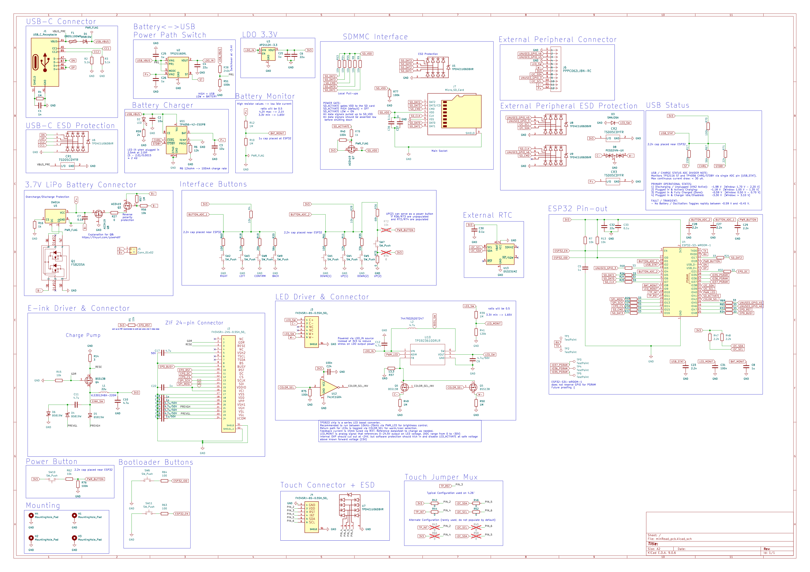

The whole design is a single A2 sheet. It divides into four domains:

```
   ┌─────────────── POWER ────────────────┐
   USB-C ─ fuse ─ Schottky ─┬─ TP4056 charger ─ BAT ─┐
                            │                        │
                            └──── TPS2116 mux ◄──────┴─ protected cell
                                      │
                                   LDO_IN ──┬── AP2112K ── 3V3
                                            └── TPS923610 (frontlight boost)

   ┌────────────── PROCESSOR ──────────────┐
   ESP32-S3-WROOM-1  ── native USB (no UART bridge)
                     ── 4-bit SDMMC ── microSD (power-gated)
                     ── SPI ── 24-pin e-paper ZIF
                     ── I²C ── RTC + touch panel
                     ── 3× ADC ── buttons ×2, battery, USB status, frontlight
```

**Three voltage domains:**

| Domain | Range | Feeds |
|---|---|---|
| `USB_VBUS` | ~4.4–5 V | charger, mux input 1 |
| `P+` / `LDO_IN` | 3.0–5 V | mux output → LDO, frontlight boost |
| `3V3` | 3.3 V | everything digital |
| *(local)* `LED_SW` | up to 24.5 V | frontlight LEDs only |
| *(local)* panel HV | ±15–22 V | e-paper gate/source rails only |

---

## 3. Power chain

### 3.1 USB-C input & protection

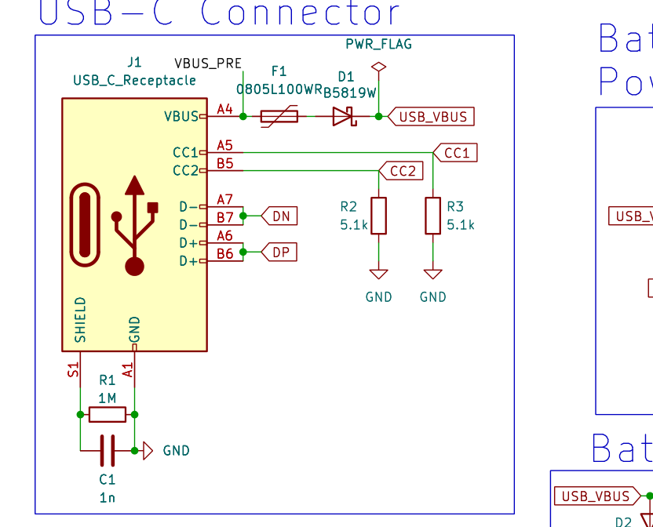

`J1` is a 14-pin USB 2.0 Type-C receptacle. Both VBUS pins and both GND pins are paralleled,
and D+/D− from both sides are tied together — standard for a USB 2.0 sink in a reversible
connector.

**`R2` / `R3` = 5.1 kΩ from CC1 / CC2 to ground.** This is what makes the board a
USB-C *sink*. A source detects those pull-downs and enables VBUS. Two separate 5.1 k
resistors (not one shared) is correct — it lets the source determine cable orientation.

**Input protection chain:** `VBUS_PRE → F1 → D1 → USB_VBUS`

- **`F1` `0805L100WR`** — 1.0 A hold / 1.95 A trip PPTC. Resettable overcurrent protection.
- **`D1` B5819W** — Schottky blocking diode preventing back-feed into the connector.

**Shield handling:** `R1` (1 MΩ) ∥ `C1` (1 nF) from shell to GND. The classic arrangement —
DC-isolates chassis from signal ground (breaking ground loops) while giving high-frequency
noise a low-impedance path. Common on any board where the shell may touch an enclosure.

**Power LED:** `D2` + `R59` (2 kΩ) across `USB_VBUS` → ~1.5 mA. Deliberately dim; it only
lights when USB is attached, so it never costs battery runtime.

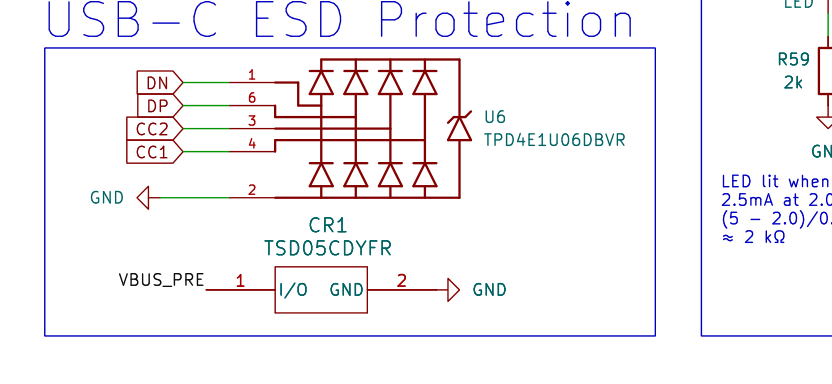

**`U6` `TPD4E1U06DBVR`** clamps D+, D−, CC1 and CC2 — a 4-channel, ultra-low-capacitance
(0.7 pF) TVS array. Low capacitance matters here: anything heavier would distort USB
full-speed edges. **`CR1` `TSD05CDYFR`** clamps the VBUS rail itself.

---

### 3.2 Battery charger

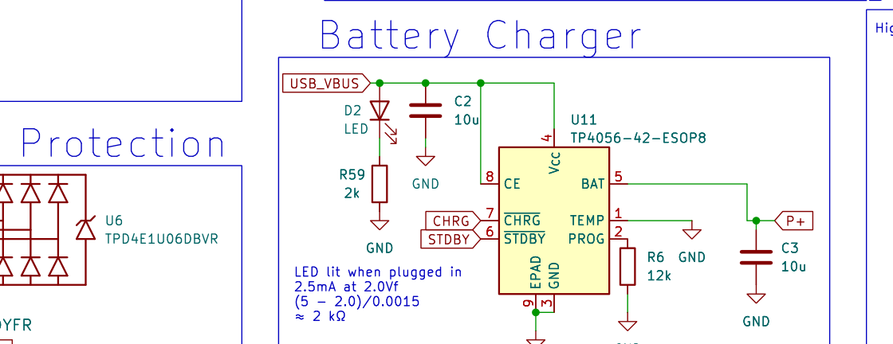

**`U11` `TP4056-42-ESOP8`** — a standalone linear Li-ion charger, 4.2 V float.

| Pin | Connection | Meaning |
|---|---|---|
| `VCC` (4) | `USB_VBUS` | charge only from USB |
| `BAT` (5) | `P+` | charges the protected cell |
| `PROG` (2) | `R6` = 12 kΩ | **I = 1200/12k = 100 mA** |
| `TEMP` (1) | GND | NTC thermistor disabled (datasheet-sanctioned) |
| `CE` (8) | `USB_VBUS` | always enabled when USB present |
| `EPAD` (9) | GND | thermal path |

**Why 100 mA?** Gentle. It suits packs from ~200 mAh upward and keeps dissipation trivial —
`(5 V − 3.7 V) × 0.1 A` = 130 mW, about **+5 °C** in an ESOP-8 with thermal vias. For a
device that spends most of its life asleep, slow charging costs nothing. Raising it later is
a single resistor (`R6` = 4.7 k → ~255 mA).

**`CE` tied to `VCC`** means charging cannot be inhibited in firmware. That is a deliberate
simplification: charging is automatic whenever USB is present.

The `CHRG` and `STDBY` open-drain status outputs feed the status ladder ([§3.7](#37-usb--charge-status)).

---

### 3.3 Cell protection & reverse polarity

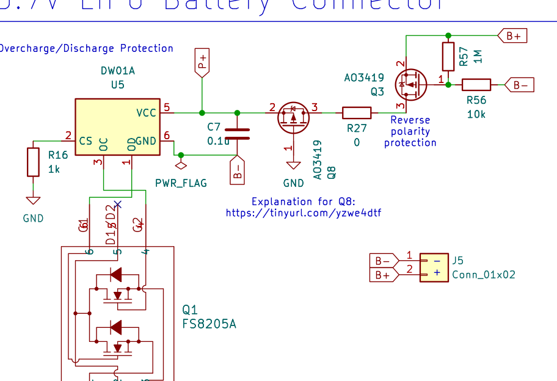

**This block is what makes "battery agnostic" safe**, and it is the reason you can attach a
bare, unprotected LiPo.

**`U5` DW01A + `Q1` FS8205A** — the standard 1-cell protection pair.

The DW01A monitors cell voltage and current, and drives two N-channel MOSFETs inside the
FS8205A (a common-drain dual):

| Condition | Threshold | Action |
|---|---|---|
| Over-charge | 4.30 V | `OC` opens the charge FET |
| Over-discharge | 2.40 V | `OD` opens the discharge FET |
| Over-current / short | 150 mV across R_DS(on) | both open |

The FETs are back-to-back so that blocking one direction still permits the other through the
opposite body diode — an over-discharged cell can still be charged, and an over-charged cell
can still be discharged.

**Two details that are easy to get wrong, and are right here:**

1. **`R16` (1 kΩ) from `CS` to the pack-negative side, not cell-negative.** The DW01A senses
   current as the voltage developed across *both* FETs' R_DS(on); its `GND` sits at `B−`
   while `CS` sits at system ground. Reversing these breaks current sensing. The 1 k also
   provides latch-up protection when a charger is connected to an over-discharged pack.
2. **`C7` (0.1 µF) between `P+` and `B−`.** This looks odd — it is not connected to system
   ground. But the DW01A's ground reference *is* `B−`, so this is exactly the datasheet's
   recommended VCC decoupling cap.

**Reverse-polarity protection: `Q3` + `Q8` (AO3419 P-channel), back to back.**

`J5` is a 2-pin JST-PH battery connector, and users will eventually plug a cell in backwards.
`Q3`'s gate is driven from a `R57`/`R56` (1 M / 10 k) divider referenced to `B−`, so:

- **Correct polarity** → gate pulled ~3.3 V below source → both FETs enhance → current flows
- **Reversed** → `Q3` blocks, and its body diode faces the wrong way to help → no current

Two FETs are needed because a single MOSFET always conducts through its body diode in one
direction. Back-to-back gives true bidirectional blocking. The divider is high-value
(1 M / 10 k ≈ 4 µA) specifically because it sits **outside** the protection FETs and the
DW01A can never disconnect it.

---

### 3.4 Power-path mux

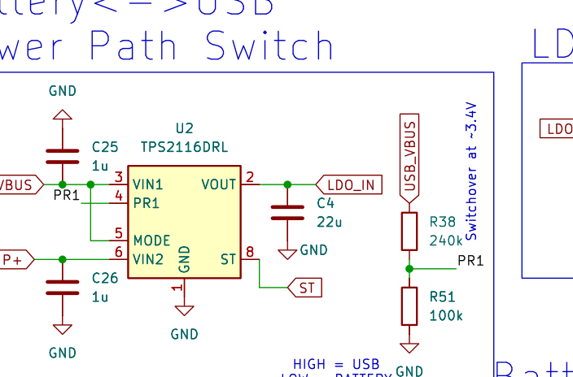

**`U2` `TPS2116DRL`** — a 2:1 priority power multiplexer choosing between USB and battery.

| Pin | Connection |
|---|---|
| `VIN1` (3) | `USB_VBUS` |
| `VIN2` (6) | `P+` (protected cell) |
| `VOUT` (2, 7) | `LDO_IN` |
| `MODE` (5) | `USB_VBUS` → **priority mode** |
| `PR1` (4) | `R38`/`R51` divider from `USB_VBUS` |
| `ST` (8) | status → ladder |

**Priority mode with a threshold divider.** `R38` = 240 k, `R51` = 100 k, `V_REF` = 1.00 V:

```
V_switchover = 1.00 V × (240k + 100k) / 100k = 3.40 V   (3.13–3.67 V worst case)
```

Above ~3.4 V on USB, the board runs from USB and the battery is untouched. Below it, the mux
hands over to the cell. **Break-before-make** switching (8 µs) prevents the two sources
shorting together; `C4` (22 µF) on the output holds the rail up across the gap.

The device also blocks reverse current at ~42 mV, so a charged battery cannot back-feed a
collapsed USB rail.

**Why a mux rather than diode-OR?** A diode-OR wastes a forward drop continuously and cannot
express priority. The TPS2116's ~40 mΩ FET path costs almost nothing, and priority means the
battery genuinely rests while USB is present.

---

### 3.5 3.3 V regulation

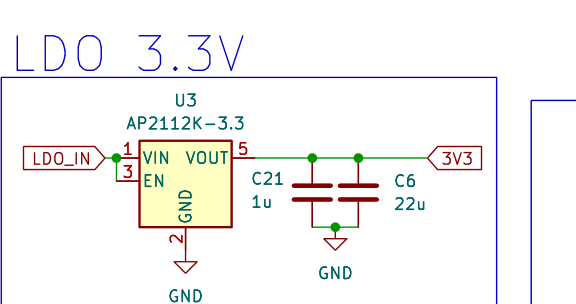

**`U3` `AP2112K-3.3`** — 600 mA LDO, fixed 3.3 V.

`EN` is tied to `VIN`, so the rail is **always live** whenever any source is present. There is
no hardware off switch — "off" means ESP32 deep sleep. This is a deliberate simplification
consistent with an e-paper device: the display holds its image with zero power, so "off" and
"asleep" look identical to the user.

Decoupling is generous: `C4` 22 µF in, and on the output `C6` 22 µF, `C32` 22 µF, `C10`/`C37`
4.7 µF, plus a spread of 1 µF and 0.1 µF locals.

**Note the frontlight boost does *not* run from 3V3** — it is fed from `LDO_IN`, upstream of
the LDO. Boosting to 20 V from a rail that an LDO has already dropped would be a pointless
double conversion, and it would put ~130 mA through a small SOT-23-5. The designer's own
schematic note says exactly this: *"Powered via LDO_IN source instead of 3V3 to reduce stress
on LDO output power."*

---

### 3.6 Battery monitoring

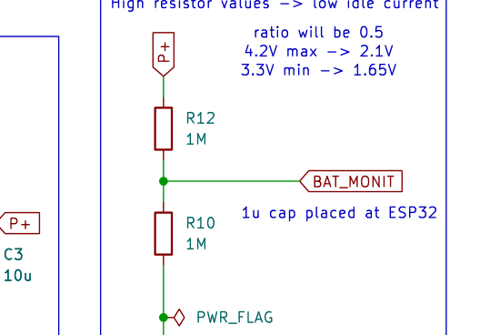

`R12` / `R10` (1 M / 1 M) divide `P+` by two into `IO8`, with `C8` (1 µF) as a reservoir.

- 4.2 V (full) → 2.10 V
- 3.0 V (empty) → 1.50 V

Both sit comfortably inside ADC1's range.

**Why 1 MΩ resistors?** Idle current. 2 MΩ total draws ~2 µA — significant when the whole
board sleeps at ~95 µA. The trade-off is ~500 kΩ source impedance, well above the ESP32
ADC's ~10 kΩ preference, which is what `C8` compensates for: it holds charge during the
sampling window. The designer's note reads *"High resistor values → low idle current."*

**It measures `P+`, not `B+`** — downstream of the protection and reverse-polarity FETs
(~146 mΩ). That is the right choice for two reasons: the divider current then flows *through*
the protection (so the DW01A can cut it off at over-discharge), and a reversed cell cannot
drive the ADC pin negative. The cost is a small load-dependent offset — ~7 mV at 50 mA,
~73 mV at 500 mA — so sample when the radio is quiet.

---

### 3.7 USB / charge status

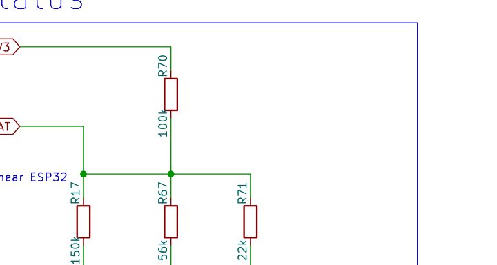

Three open-drain status signals are encoded onto **one ADC pin** (`IO2`) through a resistor
ladder — a neat piece of pin economy.

```
3V3 ──R70 100k──┬── USB_STAT (IO2) ──C23 2.2n── GND
                ├──R17 150k── ST     (TPS2116)
                ├──R67  56k── CHRG   (TP4056)
                └──R71  22k── STDBY  (TP4056)
```

Each asserted signal pulls its resistor to ground, and the resulting divider gives a distinct
voltage:

| State | Asserted | `USB_STAT` |
|---|---|---:|
| USB present, charger idle | none | **3.30 V** |
| Running on battery | ST | **1.98 V** |
| Charging | CHRG | **1.19 V** |
| Charge complete | STDBY | **0.60 V** |
| No battery fitted (blinks) | CHRG + STDBY | **0.45 V** |

Worst-case separation between adjacent states is 145 mV — comfortably decodable. Total ladder
current is under 30 µA, matching the designer's annotation.

The values are chosen so that combinations which *could* be ambiguous are physically
unreachable: the mux hands over at 3.4 V, below the TP4056's ~4.0 V operating minimum, so
`ST` and `CHRG` can never assert together.

The "no battery" state is a genuine TP4056 behaviour — with capacitance on `BAT` but no cell,
it cycles between charge and termination, blinking `CHRG` at 1–4 s while `STDBY` stays low.
Firmware can detect it by the *transition* rather than the level.

---

## 4. The processor

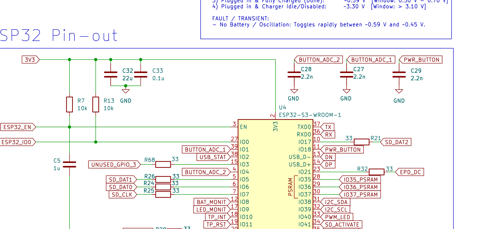

**`U4` ESP32-S3-WROOM-1** — dual-core Xtensa LX7, Wi-Fi + BLE, with **8 MB octal PSRAM**
(N8R8-class). PSRAM matters here: a 4.26" panel at 800×480 needs meaningful framebuffer
space, and e-reader firmware wants room for page rendering and font caches.

**Native USB.** `IO19`/`IO20` connect directly to the USB-C connector's D−/D+ — the S3 has a
USB OTG peripheral, so there is **no CH340/CP2102 bridge** on this board. That removes a part,
its power draw, and its driver headaches, and it enables USB Mass Storage (exposing the SD
card to a host) and native DFU.

**S31 future-proofing.** `TP3`/`TP4`/`TP5` land on `IO37`/`IO36`/`IO35`. On an octal-PSRAM S3
those pins are consumed internally by the PSRAM bus and **must not be used**. On the
ESP32-S31, whose PSRAM does not occupy them, they become three free GPIOs. They are provided
as bare test pads — unused today, available later.

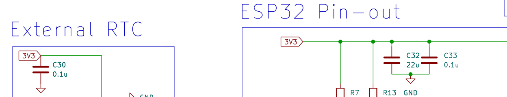

Decoupling is deliberately clustered at the module: `C32` 22 µF bulk plus `C33`/`C30`/`C24`
0.1 µF locals. Several schematic annotations ("2.2n cap placed near ESP32", "1u cap placed at
ESP32") show that the *physical* placement of the analog filter caps was treated as part of
the design, not left to layout.

---

## 5. Storage — 4-bit SDMMC

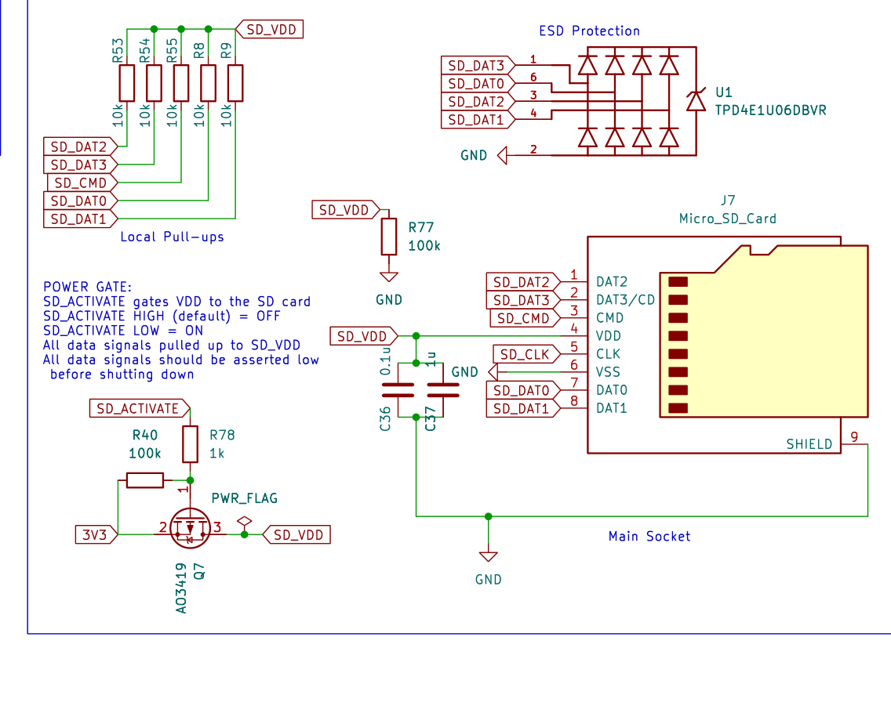

`J7` is a push-pull microSD socket wired for **4-bit SDMMC**, not SPI. That is a deliberate
performance choice: 4-bit at ~40 MHz is roughly 8× the throughput of 1-bit SPI, which matters
when loading page images or large fonts.

**Bus conditioning:**

| Function | Parts |
|---|---|
| Series termination, all 6 lines | `R21`–`R26` = 33 Ω |
| Pull-ups on DAT0–3 + CMD | `R8`, `R9`, `R53`, `R54`, `R55` = 10 kΩ |
| ESD, DAT0–3 | `U1` TPD4E1U06 |
| ESD, CLK + CMD | `U9` TPD4E1U06 |

**33 Ω series resistors** damp reflections. The ESP32's output impedance is ~30–40 Ω, so
33 Ω brings the source close to the ~60 Ω trace impedance — slightly over-damped, which is
exactly what you want for EMC.

**Pull-ups on data and command, none on clock.** This is per the SD specification: DAT and CMD
are bidirectional and must idle high, while CLK is always driven and needs no pull.

### Power gating

The card's `VDD` is **switched**, not hard-wired — `Q7` (AO3419 P-FET) with `R40` (100 k)
holding the gate off by default, driven from `IO41` (`SD_ACTIVATE`) through `R78` (1 k). The
schematic states the polarity plainly: *"SD_ACTIVATE HIGH (default) = OFF, SD_ACTIVATE LOW =
ON."*

**Why gate it at all?** An idle-but-powered SD card draws 0.2–2 mA depending on brand — up to
20× the entire board's sleep budget. There is no reliable "sleep" command in SD mode, so
cutting power is the only deterministic way to make the card cost nothing.

**Everything on the card's rail is switched with it.** All five pull-ups and both decoupling
capacitors (`C36`, `C37`) connect to `SD_VDD`, not `3V3`. This matters more than it looks: if
the pull-ups stayed on the always-on rail, they would inject current into the card's I/O pins
while its supply was at 0 V, phantom-powering it through its own ESD structures and defeating
the entire purpose.

`R77` (100 k) bleeds the rail down when gated off. SD cards need `VDD` below ~0.5 V for a true
reset; 100 k gives ~400 ms, or ~8 ms if firmware also drives the data lines low first — which
the schematic explicitly requires: *"All data signals should be asserted low before shutting
down."*

`IO41` is a good choice for this: not a strapping pin, not in the ESP32-S3 power-up glitch
table, and it comes out of reset with no internal pull — so the 100 k pull-up wins
uncontested and the card is unpowered until firmware asks for it.

---

## 6. Display interface

### 6.1 24-pin e-paper connector

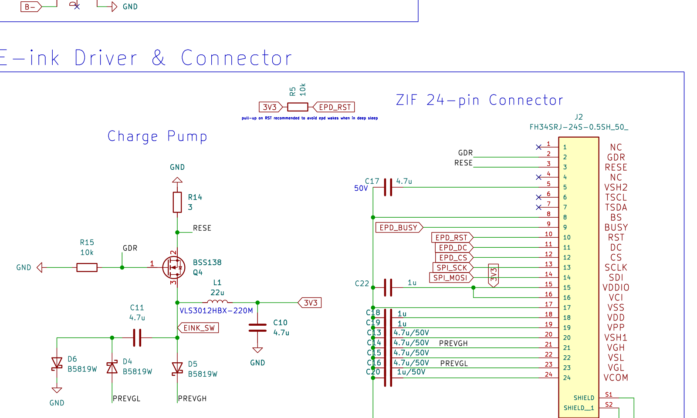

`J2` is a 24-pin, 0.5 mm-pitch ZIF (`FH34SRJ-24S-0.5SH`) — the de-facto standard for this
panel class, which is what makes the board display-agnostic.

| Pin | Signal | Connection |
|---|---|---|
| 1, 4 | NC | — |
| 2 | `GDR` | gate driver → `Q4` |
| 3 | `RESE` | current sense → `R14` |
| 5 | `VSH2` | `C17` 4.7 µF/50 V |
| 6, 7 | `TSCL`, `TSDA` | NC (touch uses `J4`) |
| 8 | `BS` | **GND** → 4-wire SPI mode |
| 9 | `BUSY` | `IO48` |
| 10 | `RST` | `IO47`, + `R5` 10 k pull-up |
| 11 | `DC` | `IO21` |
| 12 | `CS` | `IO14` |
| 13 | `SCLK` | `IO13` |
| 14 | `SDI` | `IO12` |
| 15, 16 | `VDDIO`, `VCI` | 3V3 |
| 17 | `VSS` | GND |
| 18–24 | `VDD`,`VPP`,`VSH1`,`VGH`,`VSL`,`VGL`,`VCOM` | decoupling / charge-pump rails |

All SPI and control lines carry 33 Ω series resistors (`R29`–`R34`), matching the SD bus
treatment.

**`BS` tied to GND** selects 4-wire SPI (separate D/C pin) rather than 3-wire. This is what
lets the panel use a normal hardware SPI peripheral.

**`R5` (10 k) pull-up on `RST`** — the annotation explains it: *"pull-up on RST recommended to
avoid epd wakes when in deep sleep."* Without it, a floating reset line can let the panel
self-wake, silently draining the battery.

**Every panel rail is decoupled**, with the HV rails explicitly rated 50 V:
`C13`–`C17` (4.7 µF/50 V), `C18`–`C20` (1 µF), `C22` (1 µF).

### 6.2 Charge pump

The e-paper panel needs roughly **±22 V** gate rails and ±15 V source rails, generated on-board:

```
3V3 ─ L1 (22 µH) ─┬─ EINK_SW ─ Q4 (BSS138) ─ RESE ─ R14 (3 Ω) ─ GND
                  ├─ D5 ─→ PREVGH  (positive rail, → VGH)
                  └─ C11 ─ node ─ D6 ─→ GND
                             node ─ D4 ─→ PREVGL  (negative rail, → VGL)
```

**The panel drives its own supply.** `GDR` (panel pin 2) switches `Q4`'s gate; `RESE`
(pin 3) is the panel's current-sense return through `R14` (3 Ω). The panel's internal
controller decides the switching frequency and peak current — the board only supplies the
passive power train.

This is architecturally important: it means the HV rails automatically match whatever panel
is fitted, which is a large part of how one board supports many displays.

`D5` rectifies the boost node to `PREVGH`. The `C11`/`D6`/`D4` leg is an inverting charge pump
producing the negative rail. `R15` (10 k) pulls `Q4`'s gate down so the pump stays off when
the panel is unpowered or high-Z.

**`L1` = `VLS3012HBX-220M`** (22 µH, metal-composite shielded, 3.0 × 3.0 mm). The metal
composite core has markedly lower fringing flux than a ferrite drum — worthwhile on a
2-layer board.

---

## 7. Frontlight driver

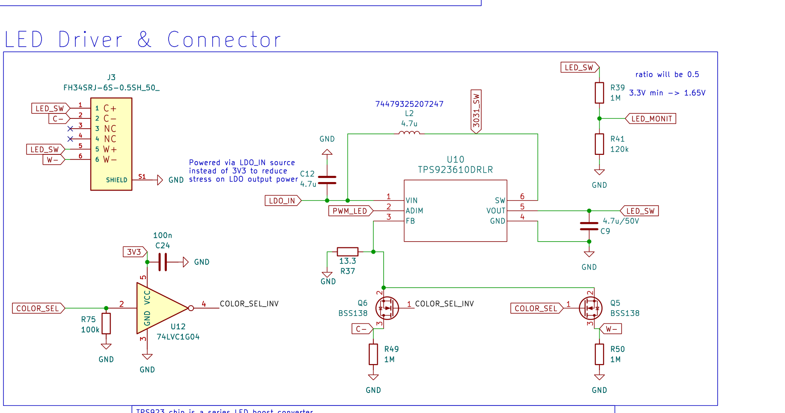

Optional block, for panels with a bonded frontlight (or an external light strip).

**`U10` `TPS923610DRLR`** — a synchronous boost LED driver, up to 24.5 V.

```
LDO_IN ─ L2 (4.7 µH) ─ SW ─┤U10├─ VOUT ─ LED_SW ─┬─ cool string ─ C− ─ Q6 ─┐
                                                 └─ warm string ─ W− ─ Q5 ─┴─ FB ─ R37 ─ GND
```

**Constant-current, not constant-voltage.** `U10` regulates `FB` to 200 mV across `R37`:

```
I_LED = 200 mV / 13.3 Ω = 15.0 mA
```

LED brightness depends on *current*, not voltage, and forward voltage varies with temperature
and part-to-part — so a current-mode driver is the correct topology. The boost simply raises
its output until 15 mA flows.

### Warm / cool selection

This is the most distinctive circuit on the board. Both LED strings share **one boost and one
sense resistor**; colour is selected by choosing which string's return path is closed:

- `COLOR_SEL` (`IO42`) → `Q5` gate (warm)
- `COLOR_SEL` → `U12` (74LVC1G04 inverter) → `COLOR_SEL_INV` → `Q6` gate (cool)

Because `U12` inverts, **exactly one string ever conducts.** The consequence is a genuine
safety property: LED current is *always* 15 mA regardless of colour, and no firmware fault
can double the load. Intermediate colour temperatures are achieved by time-multiplexing
`COLOR_SEL` — the mix ratio becomes the duty cycle.

`R49`/`R50` (1 M) bleed the two cathode nets to ground so neither floats when its FET is off.
`R75` (100 k) holds `COLOR_SEL` low at boot, so the inverter never sits at mid-rail (which
would draw shoot-through current).

### Brightness

`PWM_LED` (`IO40`) drives `ADIM`. Despite being a PWM input, this is **analog** dimming: the
part chops its internal 200 mV reference at the PWM duty cycle and low-pass filters it, so
`V_FB = duty × 200 mV` and the LED current is genuinely DC. **No visible flicker** — which
matters a great deal for a reading light. The datasheet's recommended range is 10–200 kHz.

`ADIM` is also the enable pin; held low >2.5 ms, the part enters a **130 nA** shutdown.

### Monitoring & protection

`R39`/`R41` (1 M / 120 k) divide `LED_SW` into `LED_MONIT` (`IO9`) with `C31` (100 nF), letting
firmware watch the boost output and implement a software over-voltage limit above the LED
string's known forward voltage. `D3` (SMAJ26A) clamps transients at the connector, and `D8`
(PESD2IVN-UX) protects the return lines.

> **Firmware note:** a boost always has a DC path from input to output through the inductor
> and the high-side FET's body diode, so with `U10` disabled `LED_SW` sits at roughly
> `LDO_IN − 0.7 V` rather than 0 V. `LED_MONIT` therefore reads **~0.25–0.46 V when the
> frontlight is off**, tracking battery voltage. That is the healthy off state, not a fault.
> The LED string sees at most ~4.3 V against a ~15 V forward voltage, so nothing lights.

`J3` is a 6-pin ZIF: `C+`/`W+` both to `LED_SW` (common anode), `C−`/`W−` the switched returns.

---

## 8. Touch interface

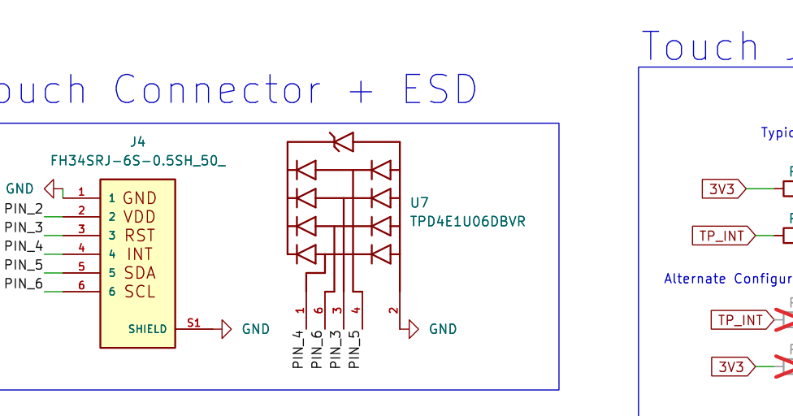

Optional block for `-FT01C`-class panels with bonded capacitive touch.

`J4` is a 6-pin 0.5 mm ZIF carrying **GND, VDD, RST, INT, SDA, SCL** — a standard I²C touch
controller interface. `TP_RST` (`IO11`) and `TP_INT` (`IO10`) are dedicated pins; SDA/SCL join
the shared I²C bus. `U7` (TPD4E1U06) provides ESD protection on all four signal lines.

**The jumper mux.** Touch panels are frustratingly inconsistent about pin order, so the board
includes a re-mapping option built from 0 Ω resistors:

| Config | Fitted | Not fitted |
|---|---|---|
| **Default** | `R42` (3V3→PIN_2), `R44` (TP_INT→PIN_4) | `R43`, `R66` |
| **Alternate** | `R43` (TP_INT→PIN_2), `R66` (3V3→PIN_4) | `R42`, `R44` |

This swaps **VDD and INT** between connector pins 2 and 4 — accommodating two common panel
pinouts without a board respin. The schematic labels the second option *"Alternate
configuration (rarely used, do not populate by default)."*

---

## 9. Human input

### 9.1 Button ladders

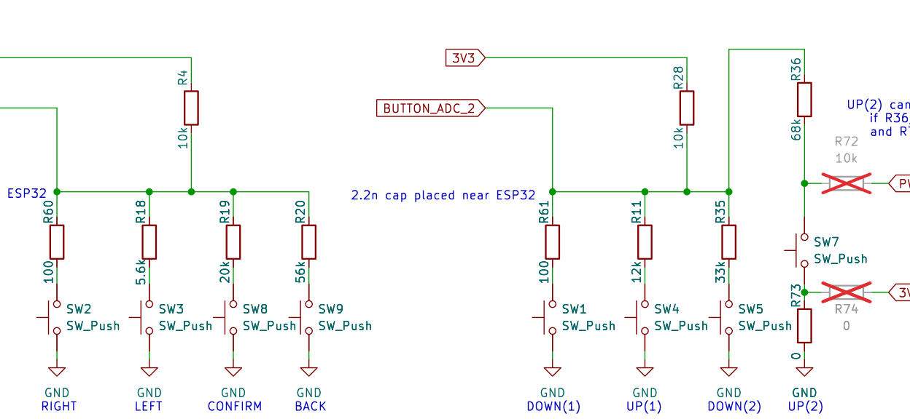

Eight buttons are read on **two ADC pins** using resistor ladders. Each button connects its
own resistor from the ADC node to ground; a 10 kΩ pull-up holds the node at 3.3 V when nothing
is pressed.

**Ladder 1 — `BUTTON_ADC_1` (`IO1`), pull-up `R4` 10 kΩ:**

| Button | Function | Resistor | Voltage |
|---|---|---|---:|
| `SW2` | RIGHT | `R60` 100 Ω | 0.03 V |
| `SW3` | LEFT | `R18` 5.6 kΩ | 1.19 V |
| `SW8` | CONFIRM | `R19` 20 kΩ | 2.20 V |
| `SW9` | BACK | `R20` 56 kΩ | 2.80 V |
| — | idle | — | 3.30 V |

**Ladder 2 — `BUTTON_ADC_2` (`IO4`), pull-up `R28` 10 kΩ:**

| Button | Function | Resistor | Voltage |
|---|---|---|---:|
| `SW1` | DOWN(1) | `R61` 100 Ω | 0.03 V |
| `SW4` | UP(1) | `R11` 12 kΩ | 1.80 V |
| `SW5` | DOWN(2) | `R35` 33 kΩ | 2.53 V |
| `SW7` | UP(2) | `R36` 68 kΩ | 2.88 V |
| — | idle | — | 3.30 V |

**Why ladders?** Pin economy — 8 buttons on 2 pins instead of 8. On a board that already
commits pins to SDMMC (6), SPI (6), I²C (2) and USB (2), that is the difference between
fitting and not fitting. It also supports the "case agnostic" goal: a different enclosure can
use a different button count by changing resistors only.

Worst-case tolerance analysis (1 % resistors, ±2 % rail, ±30 mV ADC error) gives adjacent-state
separations of 157–1654 mV — all single presses decode reliably. **Chords are not decodable**,
so firmware should treat these as single-press-only. The 100 Ω buttons dominate any
combination, which can be used as a deliberate priority scheme.

`C27`/`C28` (2.2 nF) provide anti-aliasing, not debounce — mechanical bounce is 1–10 ms and
must be handled in software. Both caps are placed physically at the ESP32 per the schematic
annotations.

### 9.2 Power button

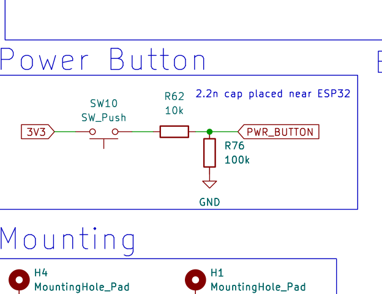

`SW10` connects `3V3` through `R62` (10 k) to `PWR_BUTTON` (`IO18`), with `R76` (100 k) as a
pull-down. Pressing gives a clean 3.00 V logic high; releasing gives a defined 0 V.

Because the 3V3 rail is always live, the power button is a **wake source** rather than a
true power switch — `IO18` is RTC-capable and can trigger `ext0` wake from deep sleep.

`R72`/`R73`/`R74` are 0 Ω configuration jumpers. The annotation explains the option:
*"UP(2) can serve as a power button if R36/R73 are unpopulated and R72/R74 are populated"* —
letting a build repurpose a ladder button as the power button, again supporting varied
enclosures.

### 9.3 Boot & reset

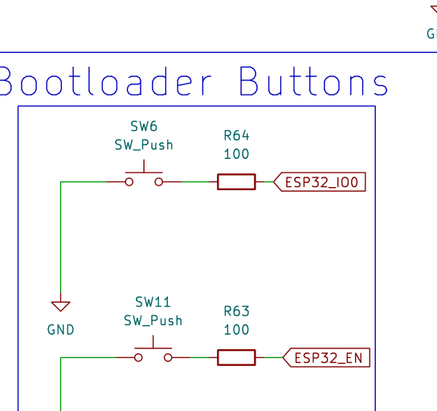

Standard ESP32 programming interface:

| Signal | Circuit | Purpose |
|---|---|---|
| `ESP32_EN` | `R7` 10 k pull-up, `C5` 1 µF, `SW11` via `R63` 100 Ω | reset, with ~10 ms RC |
| `ESP32_IO0` | `R13` 10 k pull-up, `SW6` via `R64` 100 Ω | boot mode select |

Holding `IO0` low during reset enters the ROM bootloader. The 100 Ω series resistors limit
current if firmware ever drives these pins. `C5` gives a clean power-on reset.

`SW6` uses a larger 6×3.5 mm switch — likely intended to be more accessible, as boot-mode
entry is a developer action.

---

## 10. Real-time clock

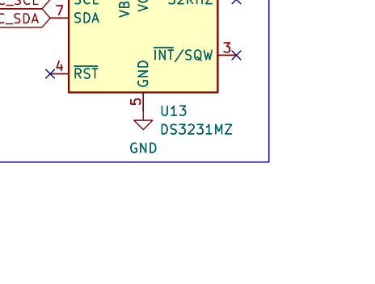

**`U13` `DS3231MZ`** — a temperature-compensated RTC, ±2 ppm (about ±1 minute/year).

The wiring deserves explanation because it looks wrong at first glance:

- **`VBAT` (6) → 3V3**
- **`VCC` (2) → GND**

This is the datasheet's **Figure 5 single-supply VBAT-only configuration**, which explicitly
requires `VCC` to be *grounded*, not floating. It is intentional and correct.

Three consequences firmware must know:

1. The oscillator **does not start until a valid I²C write occurs**, because `VCC` never rises
   above the power-fail threshold. Init code must touch the RTC.
2. `RST` is permanently held low — correctly left unconnected here.
3. Temperature compensation runs every 10 s instead of every 1 s (slightly more drift).

The trade-off: no coin cell means no true backup — time is lost if the battery is removed or
fully discharged. For an e-reader that is acceptable, and it avoids a coin cell holder that
would fight the "case agnostic" goal.

`C22` (1 µF) decouples, and `R47`/`R48` (2.2 kΩ) pull up the shared I²C bus. 2.2 k is sized for
fast-mode operation with the extra capacitance of a touch FFC and the expansion header
attached.

---

## 11. Expansion header

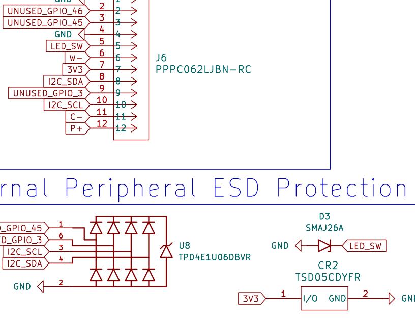

**`J6` `PPPC062LJBN-RC`** — a 2×6, 0.1"-pitch female header. This is the "one board as a basis
for any e-ink development" promise made concrete.

```
row 1:  1 GND    2 IO46   3 IO45   4 GND     5 LED_SW   6 W−
row 2:  7 3V3    8 SDA    9 IO3   10 SCL    11 C−      12 P+
```

What it exposes:

| Category | Pins |
|---|---|
| Power | `3V3` (7), `P+` raw battery (12), 2× `GND` (1, 4) |
| I²C | `SDA` (8), `SCL` (10) — shared bus, already pulled up |
| Spare GPIO | `IO46` (2), `IO45` (3), `IO3` (9) |
| Frontlight | `LED_SW` (5), `W−` (6), `C−` (11) — drive external LED strips |

**The pin ordering groups signals by voltage domain**, which matters on a 0.1" header a user
can bridge with a solder whisker or a misaligned connector. `LED_SW` (pin 5) — the only net on
the header that can reach 24.5 V — is bounded by `GND` (4), `W−` (6) and `C−` (11), all
LED-domain or ground nets. No logic pin touches it. Likewise `P+` (raw cell, up to 4.2 V) sits
at the corner where its only neighbours are the LED returns, so it cannot bridge onto the
3.3 V rail or a GPIO.

`W−` and `C−` are low-voltage in normal operation: `R49`/`R50` (1 M) bleed them to ground, and
the conducting one sits at the 200 mV `FB` voltage.

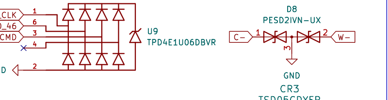

**Every signal pin is ESD-protected**: `U8` covers `IO45`/`IO3`/`SDA`/`SCL`, `U9`'s spare
channel covers `IO46`, `CR2` protects the 3V3 pin, `CR3` protects `P+`, `D3` (SMAJ26A) clamps
`LED_SW`, and `D8` (PESD2IVN-UX) covers the `C−`/`W−` returns. The three GPIOs carry 33 Ω
series resistors (`R65`, `R68`, `R69`).

Exposing `P+` is a deliberate choice — it lets a daughterboard draw meaningful current, or
implement its own regulation, rather than being limited by the LDO's remaining headroom.

---

## 12. Test points & mounting

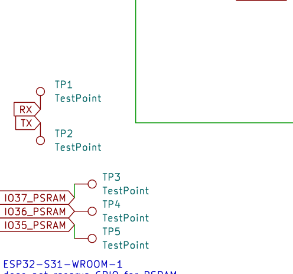

`TP1` (`RX`) and `TP2` (`TX`) expose UART0 for serial debugging — useful even though
programming happens over native USB, since the ROM bootloader and early boot messages come
out on UART.

`TP3`/`TP4`/`TP5` are the `IO37`/`IO36`/`IO35` future-proofing pads described in
[§4](#4-the-processor).

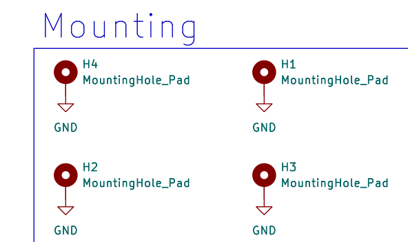

`H1`–`H4` are `MountingHole_Pad`s tied to GND — plated holes, so a metal standoff bonds the
enclosure to ground.

---

## 13. Complete GPIO map

Every ESP32-S3 pin, as used:

| Pin | GPIO | Net | Function |
|---|---|---|---|
| 3 | EN | `ESP32_EN` | Reset (SW11) |
| 4 | IO4 | `BUTTON_ADC_2` | Side button ladder (ADC1_CH3) |
| 5 | IO5 | — | SD DAT1 (via `R26`) |
| 6 | IO6 | — | SD DAT0 (via `R24`) |
| 7 | IO7 | — | SD CLK (via `R25`) |
| 8 | IO15 | — | SD CMD (via `R23`) |
| 9 | IO16 | — | SD DAT3 (via `R22`) |
| 10 | IO17 | — | SD DAT2 (via `R21`) |
| 11 | IO18 | `PWR_BUTTON` | Power button / wake |
| 12 | IO8 | `BAT_MONIT` | Battery voltage (ADC1_CH7) |
| 13 | IO19 | `DN` | USB D− |
| 14 | IO20 | `DP` | USB D+ |
| 15 | IO3 | — | Spare → `J6` pin 9 |
| 16 | IO46 | — | Spare → `J6` pin 2 |
| 17 | IO9 | `LED_MONIT` | Frontlight voltage (ADC1_CH8) |
| 18 | IO10 | `TP_INT` | Touch interrupt |
| 19 | IO11 | `TP_RST` | Touch reset |
| 20 | IO12 | — | EPD SDI (via `R29`) |
| 21 | IO13 | — | EPD SCLK (via `R30`) |
| 22 | IO14 | — | EPD CS (via `R31`) |
| 23 | IO21 | — | EPD DC (via `R32`) |
| 24 | IO47 | — | EPD RST (via `R33`) |
| 25 | IO48 | — | EPD BUSY (via `R34`) |
| 26 | IO45 | — | Spare → `J6` pin 3 |
| 27 | IO0 | `ESP32_IO0` | Boot mode (SW6) |
| 28–30 | IO35–37 | `IO3x_PSRAM` | PSRAM (S3) / spare (S31) — `TP5`/`TP4`/`TP3` |
| 31 | IO38 | `I2C_SDA` | I²C data |
| 32 | IO39 | `I2C_SCL` | I²C clock |
| 33 | IO40 | `PWM_LED` | Frontlight brightness |
| 34 | IO41 | `SD_ACTIVATE` | microSD power gate |
| 35 | IO42 | `COLOR_SEL` | Frontlight warm/cool |
| 36 | RXD0 | `RX` | UART0 → `TP1` |
| 37 | TXD0 | `TX` | UART0 → `TP2` |
| 38 | IO2 | `USB_STAT` | Status ladder (ADC1_CH1) |
| 39 | IO1 | `BUTTON_ADC_1` | Bottom button ladder (ADC1_CH0) |

**All five analog signals are on ADC1.** ADC2 is unusable while Wi-Fi is active on the
ESP32-S3, so this is a necessary and correct constraint — and with five analog functions, it
consumes a substantial share of ADC1's channels.

---

## 14. Design themes

Reading the board as a whole, several consistent principles emerge.

**1. Pin economy as an enabler.** The button ladders (8→2), the status ladder (3→1) and the
shared I²C bus are all the same move. The ESP32-S3-WROOM-1 has ~35 usable GPIO; SDMMC, SPI,
I²C and USB claim 16 before any user interface exists. Multiplexing onto ADC pins is what
leaves room for expansion.

**2. Idle current treated as a first-class constraint.** 1 MΩ dividers, a 100 k gate pull-up,
a power-gated SD card, a 130 nA-shutdown LED driver, and a 100 k (not 10 k) rail bleed. On an
e-paper device the display costs nothing to hold an image, so standby current *is* battery
life.

**3. Defense in depth on power.** PPTC → Schottky → TVS on the input; DW01A + FS8205A on the
cell; back-to-back FETs for reverse polarity; a priority mux that blocks reverse current.
Any one of these could be argued away individually; together they make "bring your own
battery" a safe proposition.

**4. ESD on everything a user can touch.** USB (`U6`), SD data (`U1`), SD clock/command
(`U9`), touch (`U7`), expansion GPIO (`U8`), plus `CR1`/`CR2`/`CR3` on rails and `D3`/`D8` on
the LED lines. Six separate arrays is unusual on a board this size and directly serves the
"hand it to anyone" goal.

**5. Configuration by resistor.** Touch pin swap, power-button reassignment, LED colour
routing. Each is a 0 Ω jumper or DNP option that lets one PCB serve several builds — exactly
what a base board needs.

**6. Let the peripheral drive itself.** The e-paper charge pump is the clearest case: the
panel's own controller runs the switching, so the board's HV rails adapt to whatever display
is fitted. This is the single biggest contributor to display agnosticism.

---

## 15. Open questions

Points where the intent could not be determined from the schematic alone. These are questions
*about this documentation*, not defects — anything I believe is a genuine issue is in
[`DESIGN_REVIEW.md`](../DESIGN_REVIEW.md).

1. **Button labels vs. physical placement.** The silkscreen text reads
   `RIGHT / LEFT / CONFIRM / BACK` for ladder 1 and `DOWN(1) / UP(1) / DOWN(2) / UP(2)` for
   ladder 2. The brief describes "4 buttons on the bottom (ADC_BUTTON_1)" and "4 buttons on
   the sides (ADC_BUTTON_2)". Is ladder 1 the bottom row, and are the `(1)`/`(2)` suffixes
   left/right side pairs? I documented the silkscreen names.

2. **Intermediate colour temperature.** Is time-multiplexing `COLOR_SEL` an intended feature,
   or is warm/cool meant as a binary choice? This changes how §7 should describe the block.

3. **Frontlight LED string.** How many LEDs in series, and what forward voltage? I used a
   6 × 3.0 V ≈ 18 V example. The real string determines the actual boost output.

4. **`R14` = 3 Ω sense value.** Was this taken from the GDEQ426T82 reference design, or
   derived? It sets the panel's charge-pump peak current, so it matters for other displays.

5. **Target sleep current.** Is there a design goal (e.g. "< 100 µA") the board is measured
   against? That would let §14 state the standby budget as an intent rather than an
   observation.

6. **Enclosure grounding.** All four mounting holes are GND-connected. Is a metal enclosure
   or metal standoffs anticipated?

7. **The `de-link` relationship.** Should this document describe what changed from de-link to
   Silkscreen? That would help readers arriving from the existing project.

---

## Appendix — component summary

| Type | Count | Notable |
|---|---:|---|
| Resistors | 78 | incl. 12× 33 Ω series, 6× DNP config jumpers |
| Capacitors | 35 | incl. 6× 50 V-rated HV |
| ICs | 13 | see below |
| Switches | 11 | 8 ladder + power + reset + boot |
| Diodes | 7 | 4× B5819W, SMAJ26A, PESD2IVN-UX, LED |
| Connectors | 7 | USB-C, 24p ZIF, 2× 6p ZIF, microSD, JST-PH, 2×6 header |
| Transistors | 7 | 3× AO3419, 3× BSS138, FS8205A |
| Test points | 5 | UART ×2, PSRAM-future ×3 |
| Mounting | 4 | plated, GND |
| TVS | 3 | TSD05CDYFR |
| Inductors | 2 | 22 µH (charge pump), 4.7 µH (frontlight) |
| Fuse | 1 | 0805L100WR PPTC |
| **Total** | **173** | |

**Integrated circuits:**

| Ref | Part | Function |
|---|---|---|
| `U1`, `U6`–`U9` | TPD4E1U06DBVR | ESD arrays (SD data, USB, touch, expansion, SD clk/cmd) |
| `U2` | TPS2116DRL | Power-path mux |
| `U3` | AP2112K-3.3 | 3.3 V LDO |
| `U4` | ESP32-S3-WROOM-1 | Processor |
| `U5` | DW01A | Cell protection controller |
| `U10` | TPS923610DRLR | Frontlight boost driver |
| `U11` | TP4056-42-ESOP8 | Li-ion charger |
| `U12` | 74LVC1G04 | Inverter (colour select) |
| `U13` | DS3231MZ | Real-time clock |

---

*Silkscreen is open-source hardware. Predecessor project: [de-link.me](https://de-link.me).*
